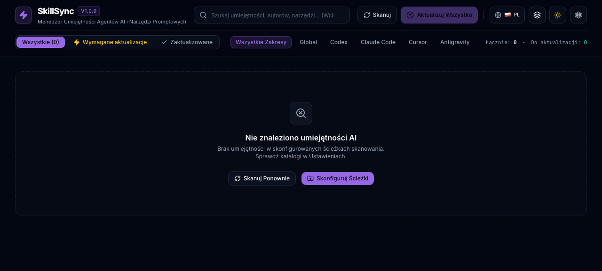
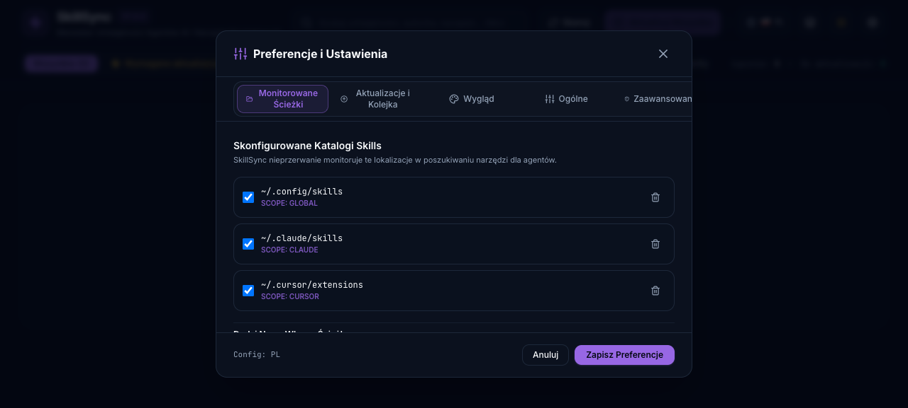

# SkillSync — AI Agent Skills Manager & Version Controller

> SkillSync is a desktop **skill management tool** that helps you **update skills**, track versions, and safely sync prompt skills across AI agent projects.

> If SkillSync saves you time, please give the project a GitHub star ⭐ and share it on social media. It helps other Claude Code, Codex, Cursor, and Gemini users find a safer way to update skills.

[](https://github.com/tomaszboloz/SkillSync/actions)
[](https://github.com/tomaszboloz/SkillSync/releases)
[](https://www.rust-lang.org/)
[](https://tauri.app/)
[](LICENSE)

> **Language versions:** **English (current)** • **[Polski](README.pl.md)**

---



*A safe starting state: add a monitored directory or rescan when no skills are detected.*



*The settings screen uses anonymized paths. Add, enable, or remove monitored locations without exposing personal data in the documentation.*

---

<!-- parity: purpose -->
## 1. What You Get

SkillSync is an open-source, cross-platform desktop application powered by **Tauri v2**, **Rust**, **React 18**, and **Tailwind CSS**. It gives teams and individual builders one place to manage prompt skills, compare installed versions with upstream releases, and recover quickly if an update is not right for a project.

- **Zero-Configuration Multi-Agent Discovery:** Automatically scans standard agent tool directories:
  - Claude Code: `~/.claude/skills`
  - Cursor: `~/.cursor/skills`
  - Google Antigravity & Gemini CLI: `~/.gemini/config/skills`, `~/.gemini/antigravity/builtin/skills`
  - OpenAI Codex: `~/.codex/skills`
  - Agent Skills-compatible tools: `~/.agents/skills`
  - Custom user-monitored directories configured via the UI
- **Zero-Rate-Limit GitHub Upstream Tracking:** Checks remote GitHub releases via redirect headers and Atom feeds without exhausting GitHub API rate limits.
- **Atomic 7-Stage Update Protocol:** Every update creates an automatic pre-update archive snapshot (`~/.skillsync/backups/`) before modifying files. If Git checkouts, file writes, or integrity validation fail, changes are instantly reverted.
- **Point-in-Time Rollback:** Restore any historical version with exact date-and-time timestamps and SemVer metadata.
- **Automated Multi-Platform Packaging:** Built-in release scripts generate native installers for macOS (`.dmg`, `.app`) and Windows (`.msi`, `.exe`) with cryptographic SHA-256 manifests.

---

<!-- parity: quickstart -->
## 2. Quick Start in Under 5 Minutes

### Step 1: Install or Run SkillSync
Download the pre-compiled installer for your operating system from the [Releases](https://github.com/tomaszboloz/SkillSync/releases) page:
- **macOS:** Download `SkillSync_1.0.0_universal.dmg` or unpack `SkillSync_1.0.0_macos.tar.gz`.
- **Windows:** Run `SkillSync_1.0.0_x64_en-US.msi` or `SkillSync_1.0.0_x64-setup.exe`.

#### macOS security and developer signature

The public CI build is not Developer ID signed or Apple-notarized unless the release explicitly says it is. Before opening a downloaded application, verify its SHA-256 checksum against `checksums.sha256` in the same GitHub Release. If Gatekeeper blocks an unsigned build, use Finder: Control-click the app, choose **Open**, then confirm **Open** in the dialog. Do this only for an asset downloaded from the official [SkillSync Releases](https://github.com/tomaszboloz/SkillSync/releases) page after verifying the checksum. You can inspect a signed build with `codesign --verify --deep --strict /Applications/SkillSync.app` and `spctl --assess --type execute /Applications/SkillSync.app`.

Or run directly from source:
```bash
# Clone the repository
git clone https://github.com/tomaszboloz/SkillSync.git
cd skillsync

# Install Node dependencies and launch Tauri desktop dev environment
npm install
npm run tauri dev
```

### Step 2: Automatic Discovery
Upon launch, SkillSync immediately scans default agent paths in parallel. Your installed skills appear in a searchable, filterable dashboard showing:
- Active version vs latest upstream GitHub release
- SemVer upgrade severity (Patch, Minor, or Major Breaking Change warning)
- Direct links to open local directories or upstream GitHub repositories
- Multi-location detection if a skill is shared across multiple agent environments

---

<!-- parity: howto_update -->
## 3. How to Update AI Agent Skills (AEO & Practical Guide)

### How to update Claude, Codex, Cursor, and Gemini skills automatically
1. **Identify Outdated Skills:** Open SkillSync or run the scanner. Outdated skills are highlighted with an amber **Update Available** badge and categorized under the `[Updates]` tab.
2. **Review Upstream Changelogs:** Click **Details** on any skill card to preview the Markdown changelog, commit history, and author release notes.
3. **Execute Atomic Update:** Click **Update** (or **Update All** in the Update Center).
   - SkillSync creates an isolated safety snapshot in `~/.skillsync/backups/<skill_id>_<timestamp>.tar.gz`.
   - Standalone Git skills fetch and checkout the target release tag.
   - Folder-based skills download upstream updates and update `SKILL.md`, `skill.json`, and explicitly declared package skill manifests.
   - The engine validates post-update manifest integrity.
4. **Instant Rollback on Demand:** If a tool behaves unexpectedly with your agent, open **Details ➔ Rollback**, choose the exact snapshot timestamp (e.g. `v1.0.0 (16.09.2026 10:15:32)`), and click **Restore**.

---

<!-- parity: architecture -->
## 4. System Architecture & Directory Hierarchy

| Directory / File | Responsibility |
|---|---|
| `src-tauri/src/services/detector.rs` | Recursive filesystem scanner for `SKILL.md`, valid `skill.json`, and explicitly marked package skill manifests across default agent directories |
| `src-tauri/src/services/git.rs` | Local Git repository operations (tag resolution, clean worktree verification, checkout) |
| `src-tauri/src/services/github.rs` | Zero-rate-limit GitHub release checking via HTTP 302 redirects, Atom feeds, and raw content downloads |
| `src-tauri/src/services/backup.rs` | Gzip tarball snapshots and `.meta.json` sidecars in `~/.skillsync/backups/` |
| `src-tauri/src/services/orchestrator.rs` | 7-stage atomic update transaction pipeline across multiple target paths |
| `src/components/` | React 18 UI components (SkillCard, SkillList, SkillDetailModal, UpdateCenterModal, SettingsModal) |
| `src/store/useSkillStore.ts` | Zustand + Immer reactive state management with error formatting and multi-location telemetry |
| `src/i18n/` | Modular internationalization engine supporting English, Polish, German, Spanish, French, Japanese, Chinese |
| `scripts/build_release.py` | Automated multi-platform packager for macOS (DMG/App) and Windows (MSI/EXE) |
| `.github/workflows/release.yml` | Multi-platform GitHub Actions build matrix for automated releases |

---

<!-- parity: platforms -->
## 5. Platform-Specific Integration

### Claude Code (`~/.claude/skills`)
Claude Code loads skills dynamically from `~/.claude/skills/<skill-name>/SKILL.md`. SkillSync detects Claude skills, parses their YAML frontmatter metadata, and syncs updates simultaneously across any other toolchains that reference the same skill.

### Cursor (`~/.cursor/skills`)
Cursor extensions and custom agent prompts located in `~/.cursor/skills` are monitored automatically. SkillSync checks semantic compatibility and ensures local customizations are never overwritten without a snapshot backup.

### Google Antigravity & Gemini CLI (`~/.gemini/config/skills`, `~/.gemini/antigravity/builtin/skills`)
Antigravity built-in skills and user-configured skills are discovered automatically. When updating skills installed across both global and Antigravity locations, SkillSync updates all canonical locations in a single coordinated transaction.

### OpenAI Codex & Custom Agents (`~/.agents/skills`)
Frameworks adhering to the Agent Skills standard (`~/.agents/skills`) are monitored for upstream drift. Dependencies and runtime permissions declared in `skill.json` or `SKILL.md` are audited during each scan.

---

<!-- parity: versioning -->
## 6. Versioning, SemVer & Classification

SkillSync strictly follows [Semantic Versioning (SemVer 2.0.0)](https://semver.org/):
- **PATCH (`vX.Y.Z+1`):** Bug fixes, prompt typo corrections, backward-compatible enhancements. Safe to auto-update.
- **MINOR (`vX.Y+1.0`):** New subagent workflows, additional tool capabilities, backward-compatible additions.
- **MAJOR (`vX+1.0.0`):** Breaking changes in skill parameters, renamed tool arguments, or altered YAML contracts. SkillSync highlights these with a `⚠️ SemVer Major` warning badge before updating.

---

<!-- parity: quality -->
## 7. Safety Protocol & Rollback Snapshots

1. **Pre-Update Verification:** Ensures the target directory exists and write permissions are granted.
2. **Snapshot Creation:** Creates an archive in `~/.skillsync/backups/<skill_id>_<timestamp>.tar.gz` and persists metadata (`snapshot_id`, `created_at`, `original_version`) in a sidecar JSON file.
3. **Execution & Integrity Check:** If any operation fails or the post-update manifest is invalid JSON/YAML, all updated locations are rolled back to the safety snapshot.
4. **Offline Capability:** Previously downloaded skills and backups function completely offline without internet connectivity.

---

<!-- parity: packaging -->
## 8. Automated Packaging for macOS & Windows

SkillSync includes local scripts and CI/CD pipelines to build standalone production application packages:

```bash
# Build desktop application for the current platform (macOS DMG or Windows MSI/EXE)
npm run build:release

# Or build via Python packager with options:
python3 scripts/build_release.py --platform auto
```

The packager performs:
1. Frontend compilation via `npm run build`
2. Desktop application compilation via Tauri v2
3. Harvesting installers into `dist-release/macos/` and `dist-release/windows/`
4. Generation of `RELEASE-MANIFEST.json` and cryptographic `SHA256SUMS.txt`

---

## FAQ

### 1. How do I update Claude Code skills?
Open SkillSync, choose a skill with an available update, review its release notes, and select **Update**. A Claude skill in `~/.claude/skills` needs a supported manifest, and a Git-backed skill needs a clean tracked worktree.

### 2. How do I update Claude Code skills automatically?
Configure periodic checks in **Settings → Updates**. Automatic discovery does not replace reviewing a major release or local Git changes.

### 3. How do I update OpenAI Codex skills?
Enable or add `~/.codex/skills` under Monitored Paths, run a scan, and update the selected skill. A Codex `SKILL.md` is recognized as a skill manifest.

### 4. How do I update Gemini CLI or Antigravity skills?
Verify the enabled Gemini or Antigravity paths in Settings. SkillSync updates only a discovered directory with a valid manifest, not arbitrary runtime folders.

### 5. Will SkillSync update a regular Node.js project?
No. Its `package.json` must explicitly enable `skill` or `ai-skill`; a documentation, gallery, or workspace package is ignored.

### 6. Why is package.json alone not a skill manifest?
Monorepos and tool repositories contain many package files. Treating each one as a skill creates false updates and can overwrite an application or library version.

### 7. What does a dirty-state error mean?
Git found an uncommitted modification in a tracked file. Commit or deliberately set aside that change after reviewing the diff, then retry the update.

### 8. Do untracked files block an update?
They do not block it merely for being untracked. Git may still stop a checkout if one would be overwritten by the selected upstream version.

### 9. Will an update overwrite my prompts?
An update does not start with modified tracked Git files. SkillSync creates a snapshot before the file-changing stage so rollback remains available.

### 10. Where are backups stored?
They are stored by default in `~/.skillsync/backups/`. The skill detail view lists snapshots and timestamps.

### 11. How do I restore an earlier skill version?
Open the skill details, navigate to rollback, select the required snapshot, and restore it. Restoration returns that target location to the archived state.

### 12. Can I monitor a custom skills folder?
Yes. Add it in **Settings → Monitored Paths**, choose an agent scope, and save the preferences.

### 13. Can one update synchronize several locations?
Yes, when scanning identifies them as the same skill. Each target is validated before mutation and receives a snapshot.

### 14. Can I install prerelease skills?
Use the prerelease option in **Settings → Updates**. Prereleases deserve extra review because their contract may change before a stable release.

### 15. What is the difference between patch, minor, and major?
A patch normally fixes defects, a minor version adds compatible functionality, and a major version may contain breaking changes. Read a major release before updating it.

### 16. Does SkillSync work offline?
Local discovery and existing backups are local operations. Checking upstream or downloading an update requires access to that skill’s remote source.

### 17. Why is my skill missing from the list?
Confirm its monitored path is enabled and that the folder contains `SKILL.md`, valid `skill.json`, or explicit package-skill metadata. A README alone is not a manifest.

### 18. Why was an update rejected before a backup was created?
That is intentional. A directory without a valid skill manifest is not a safe transaction target, so the app performs no write against it.

### 19. Where can I check the SkillSync version?
Open **Settings → General** and choose **Check for updates**. The result shows the current version and, when available, a release link.

### 20. Does SkillSync upload my prompts?
Discovery, validation, and snapshots are local. Network access is used only to check or retrieve data from the selected skill’s upstream source.

### 21. What should I include in an update bug report?
Include the exact error, app version, operating system, and whether the skill uses Git, `SKILL.md`, or `skill.json`. Do not share private prompts or full personal paths unless they are necessary and safe to disclose.

---

<!-- parity: acceptance -->
## 9. Quality Gates & Verification

Before every release, run the comprehensive verification suite:

```bash
# Run Rust core unit and integration tests (detector, GitHub, atomic update, rollback)
cd src-tauri && cargo test -- --nocapture

# Run frontend TypeScript type-check and Vite production build
cd .. && npm run build

# Check TypeScript/React code style and known dependency vulnerabilities
npm run lint
npm audit
```

---

## Search intent and keyword coverage

This documentation answers real user tasks; it does not promise ranking results. Covered intent phrases include: skill management tool, update skills, AI skills updater, prompt skills manager, how to update skills, how to update Claude Code skills, how to update Claude skills automatically, how to update Codex skills, how to update OpenAI Codex skills, how to update Cursor skills, how to update Gemini skills, how to update Gemini CLI skills, how to update Antigravity skills, manage prompt skills efficiently, sync skills across projects, safe skill update, skill backup, skill rollback, skill version control, prompt version control, monitored skill paths, SKILL.md detector, skill.json manifest, ai-skill manifest, package.json skill manifest, Git dirty state skills, Git skill update, AI agent skills manager, Claude Code skills manager, Codex skills manager, Cursor skills manager, Gemini skills manager, restore a previous skill version, SkillSync version check, prompt updater, AI coding agent tools, Agent Skills manager.

---

## 📄 License & Attribution
Built by [Tomasz Bołoz](https://www.damtox.pl). Distributed under the MIT License. See [LICENSE](LICENSE) for details.

## Contributing and security

See [CONTRIBUTING.md](CONTRIBUTING.md) before opening a change and [SECURITY.md](SECURITY.md) for responsible vulnerability reporting. Never include tokens, private prompts, customer data, or full home-directory paths in public issues or logs.
