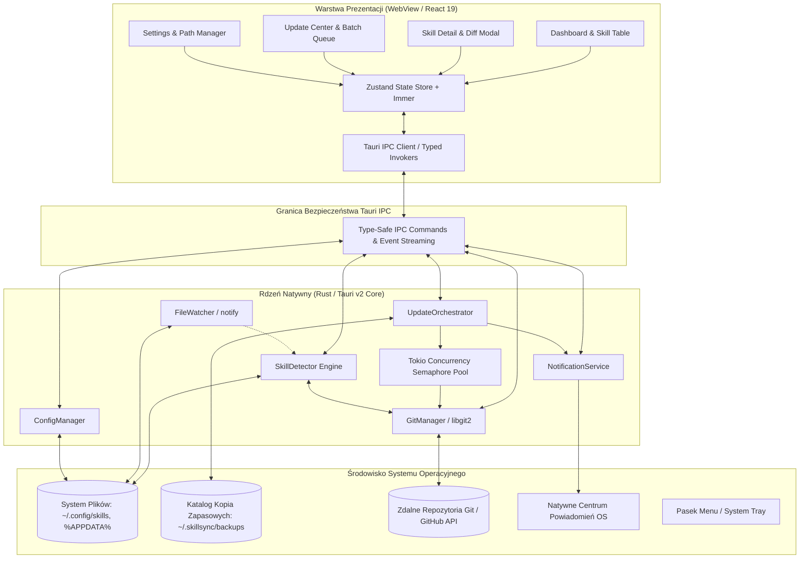
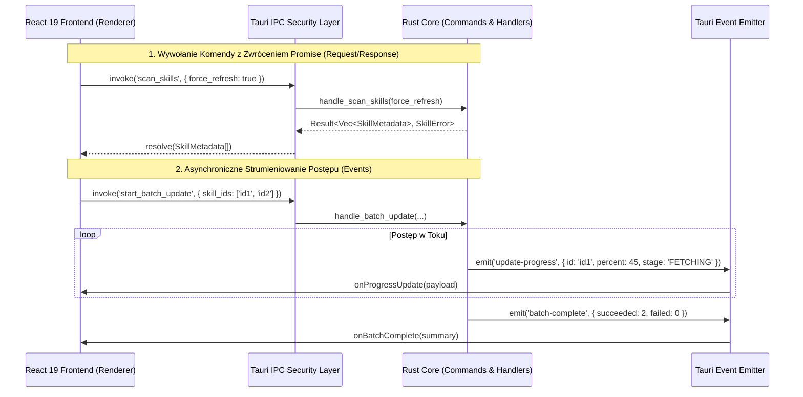

# Architektura Systemu SkillSync

Niniejszy dokument szczegółowo opisuje architekturę systemu **SkillSync** — natywnej aplikacji desktopowej (macOS & Windows) służącej do zarządzania cyklem życia, wersjonowania, audytu i atomowej aktualizacji rozszerzeń (skills) dla agentów sztucznej inteligencji.

---

## 1. Zasady Projektowe i Wymagania Niefunkcjonalne

Architektura SkillSync została zaprojektowana w oparciu o cztery fundamentalne zasady:

1. **Zero-Trust File Integrity (Brak Ryzyka Utraty Danych):** Żadna operacja Git ani aktualizacja pliku nie może modyfikować stanu katalogu roboczego użytkownika bez uprzedniego utworzenia punktu przywracania (atomic snapshot). Każda nieudana operacja skutkuje automatycznym rollbackiem.
2. **Sub-Second Responsiveness (Wysoka Wydajność I/O):** Skanowanie setek katalogów i repozytoriów Git jest realizowane w natywnym kodzie Rust z wykorzystaniem bezpośrednich powiązań do biblioteki `libgit2` (C) bez powolnego uruchamiania procesów potomnych powłoki (`git CLI`).
3. **Minimalny Ślad Zasobów (Low Memory & CPU Footprint):** W stanie bezczynności aplikacja zużywa poniżej 50 MB pamięci RAM, a wbudowany monitor plików (`notify` crate) wykorzystuje natywne zdarzenia jądra systemu (`FSEvents` na macOS, `ReadDirectoryChangesW` na Windows), nie obciążając procesora ciągłym odpytywaniem (polling).
4. **Rozdzielenie Warstwy Prezentacji od Warstwy Domenowej (Strict Separation of Concerns):** Interfejs użytkownika w React 19 odpowiada wyłącznie za renderowanie stanu i obsługę interakcji. Cała logika biznesowa, operacje kryptograficzne, sieć i system plików są odizolowane w procesie głównym Tauri w języku Rust.

---

## 2. Diagram Architektury Wysokopoziomowej



---

## 3. Dekompozycja Modułów Rdzenia Rust

### 3.1. SkillDetector Engine
Moduł odpowiedzialny za bezkonfiguracyjne odnajdywanie i katalogowanie zainstalowanych umiejętności.

- **Kluczowe Odpowiedzialności:**
  - Odpytanie `ConfigManager` o listę monitorowanych ścieżek (`paths.monitored`).
  - Rekurencyjna eksploracja drzew katalogów przy użyciu wielowątkowej biblioteki `walkdir` (ograniczenie głębokości `max_depth = 3`).
  - Heurystyczna identyfikacja markerów umiejętności:
    - `skill.json`: Oficjalny manifest z metadanymi SemVer i zależnościami.
    - `SKILL.md`: Plik Markdown ze strukturą metadanych w formacie YAML frontmatter.
    - `package.json`: Projekt Node.js zawierający flagę `"ai-skill": true` lub pole `"agent"`.
    - `.git/`: Repozytorium Git bez dodatkowego manifestu (wykrywanie po tagach release).
  - Pamięć podręczna (In-Memory Cache): Wyniki skanowania są przechowywane w pamięci ze znacznikiem czasu (TTL = 5 minut) w celu eliminacji zbędnych odczytów dysku przy częstych zmianach widoków w UI.

### 3.2. GitManager (Wrapper libgit2)
Niskopoziomowy komponent zarządzający operacjami kontroli wersji.

- **Kluczowe Odpowiedzialności:**
  - Wykrywanie repozytoriów Git na dysku (`git2::Repository::discover`).
  - Parsowanie konfiguracji zdalnej (`remote.origin.url`) z automatycznym rozpoznawaniem GitHub, GitLab oraz serwerów prywatnych.
  - Odczyt bieżącego stanu roboczego (weryfikacja czy w repozytorium nie ma niezacommitowanych zmian — dirty state detection).
  - Pobieranie obiektów i referencji (`git fetch --tags`) bez uruchamiania procesów potomnych powłoki systemowej.
  - Parsowanie referencji tagów i mapowanie ich na wersje SemVer przy użyciu crate'a `semver`.
  - Atomowy checkout do wskazanego tagu z zabezpieczeniem przed niepożądanym stanem detached HEAD.
  - Bezpieczna obsługa poświadczeń (SSH Agent, Git Credential Manager w macOS Keychain i Windows Credential Manager).

### 3.3. UpdateOrchestrator
Serce systemu aktualizacji, zarządzające transakcyjnym cyklem życia uaktualnień.

- **Kluczowe Odpowiedzialności:**
  - Koordynacja kolejki aktualizacji masowych (Batch Queue).
  - Ograniczanie współbieżności za pomocą `tokio::sync::Semaphore` (zapobieganie blokowaniu przepustowości łącza i limitom GitHub API).
  - Realizacja 7-etapowego protokołu aktualizacji atomowej:
    1. Walidacja stanu przed aktualizacją.
    2. Utworzenie spakowanego archiwum snapshotu w `~/.skillsync/backups/`.
    3. Pobranie najnowszego tagu z repozytorium zdalnego.
    4. Fast-forward checkout do docelowego tagu.
    5. Walidacja integralności plików po aktualizacji (sprawdzenie poprawności JSON/YAML).
    6. Usunięcie starych kopii zapasowych przekraczających politykę retencji.
    7. W przypadku błędu: natychmiastowe rozpakowanie snapshotu i przywrócenie stanu pierwotnego.
  - Strumieniowanie postępu do interfejsu użytkownika za pośrednictwem zdarzeń `tauri::Emitter`.

### 3.4. ConfigManager
Zarządca konfiguracji aplikacji i preferencji użytkownika.

- **Kluczowe Odpowiedzialności:**
  - Przechowywanie konfiguracji w formacie JSON w ustandaryzowanych lokalizacjach systemowych:
    - macOS: `~/Library/Application Support/com.skillsync.desktop/config.json`
    - Windows: `%APPDATA%\SkillSync\config.json`
  - Atomowy zapis konfiguracji (zapis do pliku tymczasowego `.tmp` i zamiana atomowa `fs::rename`), co eliminuje ryzyko uszkodzenia pliku konfiguracyjnego przy nagłym zaniku zasilania.
  - Walidacja danych wejściowych z wykorzystaniem atrybutów `serde` i wartości domyślnych (`Default`).

### 3.5. NotificationService
Zarządca powiadomień systemowych i integracji z powłoką systemu operacyjnego.

- **Kluczowe Odpowiedzialności:**
  - Wysyłanie natywnych powiadomień na pulpit za pośrednictwem `tauri-plugin-notification`.
  - Agregowanie powiadomień (Batching / Throttling) — w przypadku masowej aktualizacji 20 skilli użytkownik otrzymuje jedno powiadomienie zbiorcze zamiast 20 pojedynczych alertów.
  - Obsługa ikony w tacce systemowej (System Tray) z menu kontekstowym (Check for Updates, Pause Watcher, Quit).

---

## 4. Model Komunikacji Międzyprocesowej (IPC) i Bezpieczeństwo

Tauri v2 implementuje bezpieczny model komunikacji IPC pomiędzy procesem renderera (WebView) a procesem natywnym (Rust Core).

### 4.1. Przepływ Komend i Zdarzeń



### 4.2. Zasady Bezpieczeństwa IPC
- **Brak Dostępu do Node.js w WebView:** W odróżnieniu od frameworka Electron, w oknie WebView nie istnieje obiekt `process`, `fs` ani `child_process`. Przejęcie kontroli nad warstwą HTML/JS nie pozwala na bezpośrednie wykonanie kodu na maszynie użytkownika.
- **Rygorystyczna Walidacja Typów:** Wszystkie komendy IPC przyjmują i zwracają wyłącznie struktury silnie typowane w Rust i zmapowane 1:1 na interfejsy TypeScript.
- **Whitelist Ścieżek (Path Scoping):** Operacje odczytu i zapisu na systemie plików są ograniczone wyłącznie do zadeklarowanych przez użytkownika ścieżek monitorowanych oraz katalogu cache aplikacji.

---

## 5. Model Współbieżności i Pula Zadań Tokio

Operacje sieciowe Git oraz skanowanie dysku są z natury operacjami asynchronicznymi i blokującymi wejście/wyjście. Architektura SkillSync wykorzystuje asynchroniczny runtime `tokio`:

```rust
// Szkic architektury puli współbieżności
pub struct UpdateQueueManager {
    semaphore: std::sync::Arc<tokio::sync::Semaphore>,
    task_channel: tokio::sync::mpsc::Sender<UpdateTask>,
}

impl UpdateQueueManager {
    pub fn new(max_concurrent_workers: usize) -> Self {
        let semaphore = std::sync::Arc::new(tokio::sync::Semaphore::new(max_concurrent_workers));
        let (tx, mut rx) = tokio::sync::mpsc::channel::<UpdateTask>(100);

        tokio::spawn(async move {
            while let Some(task) = rx.recv().await {
                let permit = semaphore.clone().acquire_owned().await.unwrap();
                tokio::spawn(async move {
                    task.execute().await;
                    drop(permit);
                });
            }
        });

        Self { semaphore, task_channel: tx }
    }
}
```

Dzięki zastosowaniu semafora (`Semaphore::acquire_owned`), nawet przy żądaniu aktualizacji 100 skilli naraz, aplikacja wykonuje jednocześnie dokładnie $N$ operacji (gdzie $N \in [1, 10]$ zgodnie z ustawieniami użytkownika), chroniąc system przed wyczerpaniem deskryptorów plików i blokadami sieciowymi.
