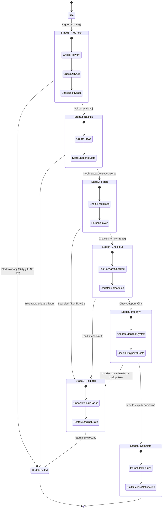

# Plan Implementacji Funkcjonalności Kluczowych: SkillSync

Niniejszy dokument precyzuje algorytmy, przepływy sterowania oraz mechanizmy wykonawcze dla kluczowych funkcjonalności aplikacji **SkillSync**.

---

## 1. Silnik Autodetekcji Skills (SkillDetector)

### 1.1. Lokalizacje Przeszukiwania
System domyślnie skanuje ustandaryzowane katalogi z uwzględnieniem specyfiki systemu operacyjnego:

```rust
// Domyślne katalogi w zależności od systemu operacyjnego
pub fn get_default_scan_paths() -> Vec<PathBuf> {
    let mut paths = Vec::new();
    let home = dirs::home_dir().expect("Nie można ustalić katalogu domowego");

    // Ścieżki globalne
    #[cfg(target_os = "macos")]
    {
        paths.push(home.join(".config/skills"));
        paths.push(home.join(".claude/skills"));
        paths.push(home.join(".cursor/extensions"));
        paths.push(home.join("Library/Application Support/Antigravity/skills"));
    }

    #[cfg(target_os = "windows")]
    {
        paths.push(home.join(".config/skills"));
        paths.push(home.join("AppData/Roaming/skills"));
        paths.push(home.join(".claude/skills"));
        paths.push(home.join(".cursor/extensions"));
    }

    paths
}
```

### 1.2. Heurystyka Rozpoznawania Markerów (Marker Files)
Każdy folder do maksymalnej głębokości `max_depth = 3` jest analizowany pod kątem występowania jednego z markerów:

```
                  ┌──────────────────────────────┐
                  │   Katalog weryfikowany       │
                  └──────────────┬───────────────┘
                                 │
                 Czy istnieje plik `skill.json`?
               ┌─────────────────┴─────────────────┐
              TAK                                 NIE
               │                                   │
      [Parsuj standard JSON]             Czy istnieje plik `SKILL.md`?
      - name, version, author          ┌───────────┴───────────┐
      - scope, entrypoint             TAK                     NIE
      - dependencies                   │                       │
                               [Parsuj Frontmatter]     Czy istnieje `package.json`?
                               - Wyciągnij YAML meta   ┌───────┴───────┐
                               - Treść instrukcji     TAK             NIE
                                                       │               │
                                              [Sprawdź "ai-skill"] Czy folder to `.git`?
                                              - Flaga lub słowa        ┌───────┴───────┐
                                                kluczowe              TAK             NIE
                                                                       │               │
                                                               [Analizuj tagi]   [Ignoruj]
```

### 1.3. Rozpoznawanie Repozytoriów Git i Upstream Origin
Dla każdego zidentyfikowanego katalogu silnik odpytuje bibliotekę `git2-rs`:
1. Sprawdza, czy w folderze istnieje podfolder `.git`.
2. Pobiera konfigurację `remote.origin.url`.
3. Normalizuje URL (zarówno format SSH `git@github.com:user/repo.git`, jak i HTTPS `https://github.com/user/repo.git`).
4. Wyciąga identyfikator repozytorium GitHub (`owner/repo`) do zapytań o Release Notes przez REST API / GraphQL lub bezpośredni `git fetch`.

---

## 2. Dwuwarstwowy System Zakresów (Scopes)

Aplikacja rozróżnia dwa poziomy zarządzania umiejętnościami:

1. **Zakres Globalny (Global Scope):**
   - Umiejętności zainstalowane w lokalizacjach dzielonych (`~/.config/skills`).
   - Dostępne dla wszystkich agentów CLI i narzędzi terminalowych.
   - Aktualizacja wpływa na cały system.
2. **Zakres Dedykowany Agenta (Per-Agent Scope):**
   - Ściśle powiązane z konkretnym środowiskiem (np. Claude Code w `~/.claude/skills`, Cursor w `.cursor/rules/skills`).
   - Posiadają specyficzne zależności (np. formaty wywołań narzędzi Anthropic lub konfiguracje reguł Cursora).
   - Aktualizacje mogą być blokowane per-agent bez wpływu na pozostałe narzędzia.

---

## 3. Algorytm 7-Etapowej Aktualizacji Atomowej

Poniższy diagram szczegółowo przedstawia maszynę stanów aktualizacji z gwarancją transakcyjności:



### Kod Realizujący Atomowy Snapshot w Rust
```rust
// src-tauri/src/services/backup.rs
use flate2::write::GzEncoder;
use flate2::Compression;
use std::fs::File;
use std::path::{Path, PathBuf};

pub fn create_atomic_snapshot(skill_path: &Path, snapshot_dir: &Path) -> Result<PathBuf, std::io::Error> {
    let timestamp = chrono::Utc::now().format("%Y%m%d_%H%M%S");
    let folder_name = skill_path.file_name().unwrap().to_string_lossy();
    let backup_filename = format!("{}_{}.tar.gz", folder_name, timestamp);
    let backup_path = snapshot_dir.join(&backup_filename);

    let tar_gz = File::create(&backup_path)?;
    let enc = GzEncoder::new(tar_gz, Compression::default());
    let mut tar = tar::Builder::new(enc);

    // Rekurencyjnie spakuj cały katalog z wyłączeniem obiektów .git
    tar.append_dir_all(".", skill_path)?;
    tar.finish()?;

    Ok(backup_path)
}
```

---

## 4. Masowa Aktualizacja i Pula Współbieżności Tokio

### 4.1. Sortowanie Topologiczne Zależności
Jeżeli skill $A$ zależy od skilla $B$ (zdefiniowane w sekcji `"dependencies"` w `skill.json`), orkiestrator buduje skierowany graf acykliczny (DAG) i aktualizuje najpierw biblioteki bazowe, zapobiegając błędom niezgodności wersji w trakcie procesu.

### 4.2. Pula Współbieżności i Semafory
Zamiast niekontrolowanego uruchamiania dziesiątek procesów sieciowych, SkillSync zarządza pulą roboczą:

```rust
// src-tauri/src/services/orchestrator.rs
use std::sync::Arc;
use tokio::sync::Semaphore;

pub async fn execute_batch_update(
    skill_ids: Vec<String>,
    max_concurrency: usize,
    app_handle: tauri::AppHandle,
) -> BatchSummary {
    let semaphore = Arc::new(Semaphore::new(max_concurrency));
    let mut tasks = Vec::new();

    for id in skill_ids {
        let sem = semaphore.clone();
        let app = app_handle.clone();
        
        tasks.push(tokio::spawn(async move {
            let _permit = sem.acquire_owned().await.unwrap();
            update_single_skill_with_events(&id, &app).await
        }));
    }

    let mut succeeded = 0;
    let mut failed = 0;

    for task in tasks {
        match task.await {
            Ok(Ok(_)) => succeeded += 1,
            _ => failed += 1,
        }
    }

    BatchSummary { succeeded, failed }
}
```

### 4.3. Strumieniowanie Postępu i Raport Końcowy
W trakcie trwania aktualizacji masowej interfejs otrzymuje regularne zdarzenia:
- `batch-progress: { total: 12, completed: 5, inProgress: 3, failed: 0 }`
- Po zakończeniu generowany jest modal z podsumowaniem: lista pomyślnie zaktualizowanych skilli, lista ewentualnych błędów z opcją natychmiastowego ponowienia (`Retry failed`).
